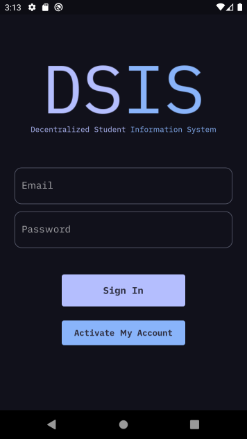
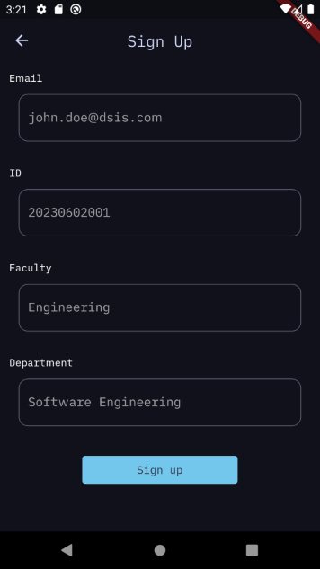
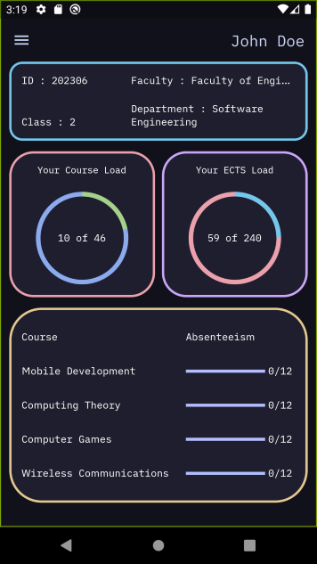
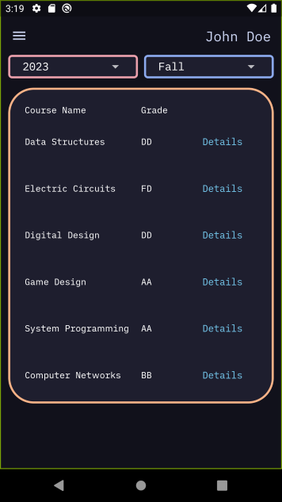
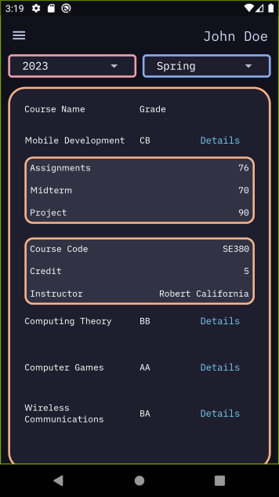
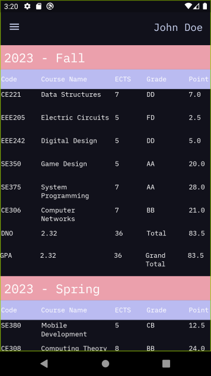

# Decentralized Student Information System - Mobile Application

This is the decentralized mobile application built with Flutter for the Decentralized Student Information System. The application allows students to view information about their courses, grades, and attendances securely on their mobile devices. It leverages blockchain technology for data storage and retrieval, as well as Firebase for authentication and user management.

## Features

- View courses: Students can access a list of courses they are enrolled in and view detailed information about each course, including course name, instructor, credits, and evaluation.
- Grades and attendances: Students can check their grades and attendance records for each course, providing them with real-time updates on their academic performance.
- Secure data storage: The application connects to a blockchain network to securely store and retrieve student information. This ensures data integrity and prevents unauthorized tampering.
- Firebase authentication: Students can log in and register using their email and password through Firebase's email/password authentication. This provides a secure and reliable authentication mechanism for accessing the application.

## Screenshots
- 
- 
- 
- 
- 
-    

## License

The Decentralized Student Information System project is open-source and released under the MIT License. You are free to use, modify, and distribute the project in accordance with the terms of the license.